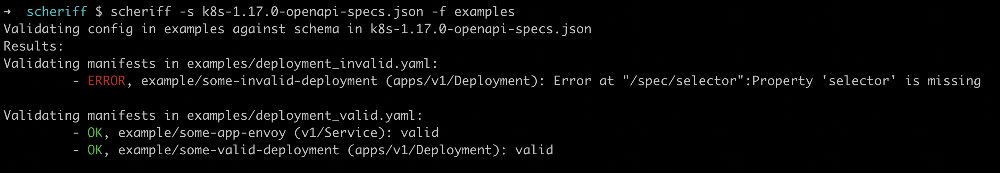
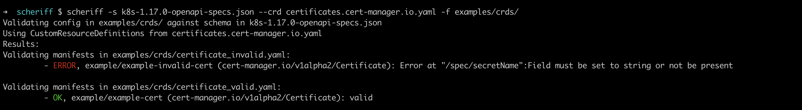

# Scheriff - Schema Sheriff

[](https://circleci.com/gh/fllaca/scheriff/tree/master)
[](https://codecov.io/gh/fllaca/scheriff)

Yet another Kubernetes manifests validation tool.

Schema Sheriff performs offline validation of Kubernetes configuration manifests by checking them against OpenApi schemas. No connectivity to the Kubernetes cluster is needed


## Contents

* [Rationale](#rationale)
* [Installation](#installation)
  + [Linux](#linux)
  + [Mac](#mac)
  + [Windows](#windows)
  + [Docker](#docker)
* [Usage](#usage)
  + [Get the schemas](#get-the-schemas)
    - [Get the schemas from the Cluster](#get-the-schemas-from-the-cluster)
    - [Download the schemas from Kubernetes Repo](#download-the-schemas-from-kubernetes-repo)
  + [Validating CRDs (Custom Resource Definitions)](#validating-crds-custom-resource-definitions)
  + [All options](#all-options)
* [How it compares to other tools](#how-it-compares-to-other-tools)

## Rationale

Kubernetes configuration can become complex and hard to maintain in medium-big projects: it can be easy to make silly syntax mistakes when writing the specs of a new resource, and the way to check the config is valid is usually deploying it or running `kubectl apply --dry-run`, which both require an actual K8s cluster to do so. This gets even more complicated when using Custom Resource Definitions (CRDs) or when wanting to validate against multiple K8s versions.

_SchemaSheriff_ aims to tackle all this by validating your K8s configuration manifests against OpenAPI schemas, which can be easily downloaded from either the cluster itself or the public Kubernetes repository (see [Get the schemas](#get-the-schemas)). This validation can be performed 100% offline without needing a connection to any K8s cluster.

## Installation

Download the latest release from [Scheriff releases](https://github.com/fllaca/scheriff/releases), unzip it and place the `scheriff` binary into your $PATH:

### Linux

```bash
wget https://github.com/fllaca/scheriff/releases/latest/download/scheriff_linux_amd64.tar.gz

tar xf scheriff_linux_amd64.tar.gz
sudo mv scheriff /usr/local/bin
```

### Mac

```bash
wget https://github.com/fllaca/scheriff/releases/latest/download/scheriff_darwin_amd64.tar.gz

tar xf scheriff_darwin_amd64.tar.gz
sudo mv scheriff /usr/local/bin
```

### Windows

1. Download latest version from `https://github.com/fllaca/scheriff/releases/latest/download/scheriff_windows_amd64.zip`
2. Unzip `scheriff_windows_amd64.zip`
3. Put `scheriff.exe` in your $PATH

### Docker

```
docker pull quay.io/fllaca/scheriff
```

## Usage

_SchemaSheriff_ usage is really simple, just use the `-f` flag to specify the files or folders containing the K8s config files to be validated, and the `-s` flag to indicate the path to the OpenApi specs of the specific Kubernetes version to be validated against:

```bash
scheriff -s k8s-1.17.0-openapi-specs.json -f examples
```



As _SchemaSheriff_ relies on the specs given by the `-s` option, the important thing then is how to [Get the schemas](#get-the-schemas) specs:

### Get the schemas

There are several ways to obtain the Kubernetes OpenAPI schemas for validation, but mainly there are two options: you can either ask for them directly to the cluster, or either download them from the Kubernetes public repository:

#### Get the schemas from the Cluster

Just by running the following command you can obtain the K8s OpenAPI specs directly from your K8s cluster:

```bash
kubectl get --raw /openapi/v2 > k8s-openapi-specs.json
```

Then you can use those specs to validate your config. Full example:

```bash
kubectl get --raw /openapi/v2 > k8s-openapi-specs.json

scheriff -s k8s-openapi-specs.json -f examples/

# Oneliner alternative using process substitution:
scheriff -s <(kubectl get --raw /openapi/v2) -f examples/
```


#### Download the schemas from Kubernetes Repo

If you want to do "offline" validation (without connecting to any K8s cluster), the OpenApi specs of all versions of Kubernetes are publicly available at `https://raw.githubusercontent.com/kubernetes/kubernetes/v${KUBERNETES_VERSION}/api/openapi-spec/swagger.json` and can be downloaded direclty from there:


```bash
KUBERNETES_VERSION=1.17.0

curl -sL "https://raw.githubusercontent.com/kubernetes/kubernetes/v${KUBERNETES_VERSION}/api/openapi-spec/swagger.json" > k8s-$KUBERNETES_VERSION-openapi-specs.json

scheriff -s k8s-$KUBERNETES_VERSION-openapi-specs.json -f examples/
```

### Validating CRDs (Custom Resource Definitions)

Custom Resource Definitions can be validated by providing the `--crd` flag with the CRD manifest files. Similarly as the Kubernetes OpenAPI specs, you can get them directly from the cluster:

```bash
kubectl get crd certificates.cert-manager.io -o yaml > certificates.cert-manager.io.yaml

scheriff -s k8s-1.17.0-openapi-specs.json --crd certificates.cert-manager.io.yaml -f examples/crds/
```



Or you can download the CRDs from a vendor URL, tipically the CRD manifests of common operators can be found in their Github repos. Example for _Cert-Manager_ CRDs:

```bash
curl -sL "https://github.com/jetstack/cert-manager/releases/download/v0.16.1/cert-manager.crds.yaml" > cert-manager.crds.yaml

scheriff -s k8s-1.17.0-openapi-specs.json --crd cert-manager.crds.yaml -f examples/crds/
```

### All options

```
$> scheriff --help

Schema Sheriff: A Kubernetes manifests validator tool

Schema Sheriff performs offline validation of Kubernetes configuration manifests by checking them against OpenApi schemas. No connectivity to the Kubernetes cluster is needed

Usage:
  scheriff [flags]

Flags:
  -c, --crd stringArray        files or directories that contain CustomResourceDefinitions to be used for validation
  -f, --filename stringArray   (required) file or directories that contain the configuration to be validated
  -h, --help                   help for scheriff
  -R, --recursive              process the directory used in -f, --filename recursively. Useful when you want to manage related manifests organized within the same directory.
  -s, --schema string          (required) Kubernetes OpenAPI V2 schema to validate against
      --version                version for scheriff

```

## How it compares to other tools

* [Kubeval](https://github.com/instrumenta/kubeval/): _SchemaSheriff_ was inspired by this amazing project. Kubeval has a rich set of handy features (like automatic downloads of schemas), and also provides offline validation of Kubernetes configuration, but it doesn't support CRD validation. It also relies on some pre-generated JsonSchemas that are maintained in a third repository. _SchemaSheriff_ supports CRD validation using the `--crd` flag, and uses directly the OpenApi schemas offered directly by Kubernetes, without needing to transform them.
* [Kube-score](https://github.com/zegl/kube-score): _Kubes-core_ is more a "best-practices" enforcer with some predefined rules to inform you about "common" errors in your K8s configuration. It can also check some API specs compliance, but it's limited to a subset of all resource kinds from the K8s stable versions. This feature is hardcoded in _Kube-score_, so you cannot plug different K8s versions schemas to check against them, neither custom CRDs.

