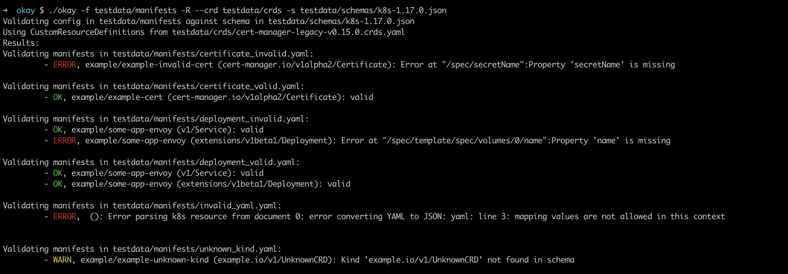

# Scheriff - Schema Sheriff

Yet another Kubernetes manifests validation tool.

Schema Sheriff performs offline validation of Kubernetes configuration manifests by checking them against OpenApi schemas. No connectivity to the Kubernetes cluster is needed


## Usage

```
$> scheriff --help

Schema Sheriff: A Kubernetes manifests validator tool

Schema Sheriff performs offline validation of Kubernetes configuration manifests by checking them against OpenApi schemas. No connectivity to the Kubernetes cluster is needed

Usage:
  scheriff [flags]

Flags:
  -c, --crd stringArray        files or directories that contain CustomResourceDefinitions to be used for validation
  -f, --filename stringArray   (required) file or directories that contain the configuration to be validated
  -h, --help                   help for scheriff
  -R, --recursive              process the directory used in -f, --filename recursively. Useful when you want to manage related manifests organized within the same directory.
  -s, --schema string          (required) Kubernetes OpenAPI V2 schema to validate against

```



